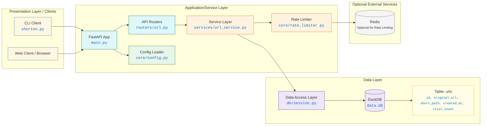

# URL Shortener

A FastAPI-based URL shortener with a web UI and DuckDB persistence.

## Features
- **Web Interface:** Shorten URLs, view previously shortened URLs (last 50) with click counts, sort by click count, and delete all links.
- **Core Functionality:** Shorten HTTP/HTTPS URLs, redirect via short path, track visit counts.
- **Technical Features:** FastAPI, DuckDB, Pydantic, vanilla JavaScript, `.env` configuration, rate limiting (optional Redis backend), pytest unit tests.

## Repository Structure
```
.
├── app                 # Main application code
│   ├── core            # Core components (config, rate limiter)
│   ├── db              # Database session management
│   ├── models          # Data models (if any, currently uses Pydantic schemas)
│   ├── schemas         # Pydantic schemas for data validation
│   ├── services        # Business logic
│   ├── static          # CSS files
│   ├── templates       # HTML templates
│   └── routers         # API endpoint definitions
├── tests               # Unit tests
├── .env.example        # Example environment variables
├── architecture.md     # System architecture diagram
├── main.py             # Application entrypoint
├── README.md           # This file
├── requirements.txt    # Dependencies
└── shorten.py          # Optional CLI tool
```

## Getting Started

### Prerequisites
- Python 3.8+
- `pip`

### Installation
1. Clone: `git clone https://github.com/utkuyucel/url-shortener.git && cd url-shortener`
2. Venv: `python -m venv venv && source venv/bin/activate` (or `venv\Scripts\activate` on Windows)
3. Install: `pip install -r requirements.txt`
4. Configure: `cp .env.example .env` and edit `.env`.
   Key settings:
   ```
   DATABASE_URL=duckdb:///./data.db
   HOST=127.0.0.1
   PORT=8000
   RATE_LIMIT_ENABLED=true
   # RATE_LIMIT_STORAGE_URI=redis://localhost:6379/0 # For Redis
   ```

### Running
- `python main.py`
- Dev: `uvicorn main:app --reload`
- Web UI: [http://127.0.0.1:8000/](http://127.0.0.1:8000/)
- API Docs (Swagger): [http://127.0.0.1:8000/docs](http://127.0.0.1:8000/docs)
- API Docs (ReDoc): [http://127.0.0.1:8000/redoc](http://127.0.0.1:8000/redoc)

### Testing
```bash
pytest
```

## CLI Usage (Optional)
`python shorten.py` (requires the FastAPI service to be running).

## API Endpoints
- `GET /`: Web UI.
- `GET /{short_key}`: Redirects and increments visit count.
- `POST /api/v1/url/shorten`: Creates a short URL.
  - Body: `{ "original_url": "string" }`
- `GET /api/v1/urls`: Lists last 50 shortened URLs.
- `DELETE /api/v1/urls`: Deletes all URLs.
- `GET /api/v1/urls/{short_path}/info`: Fetches metadata for a short URL.

## System Design
- **Presentation Layer:** Web UI (HTML/CSS/JS) served by FastAPI.
- **Application/Service Layer:** FastAPI, business logic in `app/services/`.
- **Data Layer:** DuckDB, managed via `app/db/session.py`.

## Architecture Diagram



### Data Flow
1.  **UI (`GET /`)**: FastAPI serves `index.html`.
2.  **Shorten URL (`POST /api/v1/url/shorten`)**: JS sends URL, service layer stores in DuckDB, API returns short URL.
3.  **Redirect (`GET /{short_key}`)**: Service layer gets original URL, increments `visit_count`, redirects.
4.  **List URLs (`GET /api/v1/urls`)**: Service layer fetches from DuckDB, API returns list.
5.  **Delete All (`DELETE /api/v1/urls`)**: Service layer deletes all from DuckDB.

### Database Schema (`urls` table)
| Column         | Type      | Constraints                 | Description          |
|----------------|-----------|-----------------------------|----------------------|
| `id`           | `INTEGER` | `PRIMARY KEY AUTOINCREMENT` | Unique ID            |
| `original_url` | `TEXT`    | `NOT NULL`                  | Original URL         |
| `short_path`   | `TEXT`    | `NOT NULL UNIQUE`           | Short identifier     |
| `created_at`   | `TIMESTAMP`| `DEFAULT CURRENT_TIMESTAMP` | Creation timestamp   |
| `visit_count`  | `INTEGER` | `NOT NULL DEFAULT 0`        | Visit count          |

## Rate Limiting
IP-based, configurable limits, optional Redis backend. See [Rate Limiting Documentation](docs/rate_limiting.md).

## License
GPL-3.0 license.
